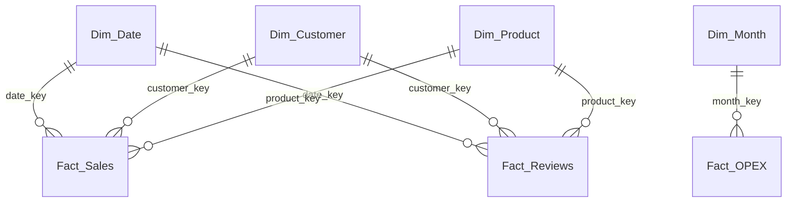
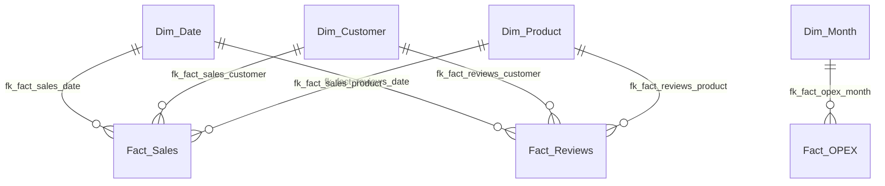

# Thiết Kế DWH PhoneShop

Tài liệu này mô tả cách thiết kế kho dữ liệu `phoneshop_dw` cho hệ thống PhoneShop.
Mục tiêu là tách dữ liệu giao dịch OLTP ra khỏi lớp phân tích, để phục vụ báo cáo, dashboard và KPI.

---

## 1. Mục tiêu thiết kế

Kho dữ liệu được xây theo mô hình sao nhỏ gọn:

- dễ nạp dữ liệu từ OLTP
- dễ viết KPI
- dễ làm dashboard
- phù hợp với báo cáo theo tháng / quý / năm
- có thể mở rộng thêm sau này nếu cần

---

## 2. Luồng dữ liệu tổng thể

```text
mockdata.py -> phoneshop_db -> etl_to_dwh.py -> phoneshop_dw -> Metabase / Power BI
```

### Ý nghĩa từng bước

- `mockdata.py`
  - sinh dữ liệu mẫu cho hệ thống bán hàng
- `phoneshop_db`
  - CSDL OLTP của web app
- `etl_to_dwh.py`
  - chuyển đổi và nạp dữ liệu sang kho phân tích
- `phoneshop_dw`
  - kho dữ liệu phân tích
- `Metabase / Power BI`
  - lớp hiển thị dashboard và KPI

---

## 3. Mô hình dữ liệu

### 3.1. Sơ đồ logic



### 3.2. Sơ đồ vật lý trong MySQL



`Fact_OPEX` là bảng tổng hợp theo tháng và hiện đã nối vật lý với `Dim_Month` trong schema.

### Ghi chú về grain

- `Dim_Date`
  - 1 dòng / 1 ngày
- `Dim_Product`
  - 1 dòng / 1 biến thể sản phẩm
- `Dim_Customer`
  - 1 dòng / 1 khách hàng
- `Fact_Sales`
  - 1 dòng / 1 dòng chi tiết đơn hàng
- `Fact_Reviews`
  - 1 dòng / 1 review
- `Fact_OPEX`
  - 1 dòng / 1 tháng

---

## 4. Bảng dimension

### 4.1. Dim_Date

**Mục đích:** lọc theo ngày, tháng, quý, năm.

| Cột | Kiểu dữ liệu | Ràng buộc | Mô tả |
|---|---|---|---|
| `date_key` | INT | PRIMARY KEY, NOT NULL | Khóa ngày dạng `yyyymmdd` |
| `full_date` | DATE | NOT NULL | Ngày thực |
| `day` | TINYINT | NOT NULL | Ngày trong tháng |
| `month` | TINYINT | NOT NULL | Tháng |
| `month_name` | VARCHAR(20) | NOT NULL | Tên tháng |
| `quarter` | TINYINT | NOT NULL | Quý |
| `year` | SMALLINT | NOT NULL | Năm |
| `day_of_week` | TINYINT | NOT NULL | Thứ trong tuần |
| `day_name` | VARCHAR(20) | NOT NULL | Tên thứ |
| `is_weekend` | BOOLEAN | NOT NULL | Cờ cuối tuần |
| `month_key` | INT | NOT NULL | Khóa tháng dạng `yyyymm` |

### 4.2. Dim_Product

**Mục đích:** lưu thông tin biến thể sản phẩm để phân tích theo sản phẩm / danh mục / tồn kho.

| Cột | Kiểu dữ liệu | Ràng buộc | Mô tả |
|---|---|---|---|
| `product_key` | BIGINT | PRIMARY KEY, NOT NULL | Khóa biến thể |
| `product_name` | VARCHAR(255) | NOT NULL | Tên sản phẩm |
| `variant_name` | VARCHAR(255) | NOT NULL | Tên biến thể |
| `category_name` | VARCHAR(100) | NOT NULL | Danh mục hiện tại |
| `parent_category` | VARCHAR(100) | NULL | Danh mục cha |
| `color` | VARCHAR(50) | NULL | Màu |
| `storage` | VARCHAR(20) | NULL | Dung lượng |
| `current_price` | DECIMAL(19,2) | NOT NULL | Giá bán hiện tại |
| `import_price` | DECIMAL(19,2) | NOT NULL | Giá nhập |
| `current_stock` | INT | NOT NULL | Tồn kho hiện tại |
| `sku` | VARCHAR(255) | NULL | Mã SKU |
| `status` | VARCHAR(20) | NULL | Trạng thái biến thể |

### 4.3. Dim_Customer

**Mục đích:** lưu thông tin khách hàng cho phân tích theo nhóm khách / thành phố / vai trò.

| Cột | Kiểu dữ liệu | Ràng buộc | Mô tả |
|---|---|---|---|
| `customer_key` | BIGINT | PRIMARY KEY, NOT NULL | Khóa khách hàng |
| `full_name` | VARCHAR(255) | NOT NULL | Họ tên |
| `email` | VARCHAR(255) | NOT NULL | Email |
| `role_name` | VARCHAR(50) | NOT NULL | Vai trò |
| `city` | VARCHAR(100) | NULL | Thành phố |
| `registered_at` | DATETIME | NULL | Ngày đăng ký |

---

## 5. Bảng fact

### 5.1. Fact_Sales

**Mục đích:** lưu dữ liệu doanh thu và vận hành theo dòng đơn hàng.

**Grain:** 1 dòng = 1 item trong đơn hàng.

| Cột | Kiểu dữ liệu | Ràng buộc | Mô tả |
|---|---|---|---|
| `sales_key` | BIGINT | PRIMARY KEY, AUTO_INCREMENT | Khóa dòng fact |
| `date_key` | INT | NOT NULL, FK -> `Dim_Date(date_key)` | Khóa ngày |
| `customer_key` | BIGINT | NOT NULL, FK -> `Dim_Customer(customer_key)` | Khóa khách hàng |
| `product_key` | BIGINT | NOT NULL, FK -> `Dim_Product(product_key)` | Khóa sản phẩm |
| `order_id` | BIGINT | NOT NULL | Mã đơn gốc từ OLTP |
| `order_status` | VARCHAR(20) | NOT NULL | Trạng thái đơn |
| `payment_method` | VARCHAR(20) | NULL | Phương thức thanh toán |
| `is_voucher_applied` | BOOLEAN | NOT NULL DEFAULT FALSE | Có voucher hay không |
| `lead_time_days` | DECIMAL(5,1) | NULL | Lead time |
| `quantity` | INT | NOT NULL | Số lượng |
| `unit_price` | DECIMAL(19,2) | NOT NULL | Giá bán tại thời điểm mua |
| `revenue` | DECIMAL(19,2) | NOT NULL | Doanh thu dòng |
| `cogs` | DECIMAL(19,2) | NOT NULL | Giá vốn dòng |
| `gross_profit` | DECIMAL(19,2) | NOT NULL | Lợi nhuận gộp dòng |
| `discount_amount` | DECIMAL(19,2) | NOT NULL DEFAULT 0 | Chiết khấu |
| `shipping_fee` | DECIMAL(19,2) | NOT NULL DEFAULT 0 | Phí ship |

### 5.2. Fact_Reviews

**Mục đích:** lưu dữ liệu đánh giá khách hàng.

**Grain:** 1 dòng = 1 review.

| Cột | Kiểu dữ liệu | Ràng buộc | Mô tả |
|---|---|---|---|
| `review_key` | BIGINT | PRIMARY KEY, AUTO_INCREMENT | Khóa review |
| `date_key` | INT | NOT NULL, FK -> `Dim_Date(date_key)` | Khóa ngày |
| `customer_key` | BIGINT | NOT NULL, FK -> `Dim_Customer(customer_key)` | Khóa khách hàng |
| `product_key` | BIGINT | NOT NULL, FK -> `Dim_Product(product_key)` | Khóa sản phẩm |
| `order_id` | BIGINT | NOT NULL | Mã đơn liên quan |
| `rating` | TINYINT | NOT NULL | Điểm đánh giá |

### 5.3. Fact_OPEX

**Mục đích:** lưu chi phí vận hành theo tháng.

**Grain:** 1 dòng = 1 tháng.

| Cột | Kiểu dữ liệu | Ràng buộc | Mô tả |
|---|---|---|---|
| `opex_key` | INT | PRIMARY KEY, AUTO_INCREMENT | Khóa dòng OPEX |
| `month_key` | INT | NOT NULL, UNIQUE, FK -> `Dim_Month(month_key)` | Khóa tháng `yyyymm` |
| `year` | SMALLINT | NOT NULL | Năm |
| `month` | TINYINT | NOT NULL | Tháng |
| `total_salaries` | DECIMAL(19,2) | NOT NULL | Tổng lương |
| `other_opex` | DECIMAL(19,2) | NOT NULL DEFAULT 0 | Chi phí khác |
| `total_opex` | DECIMAL(19,2) | NOT NULL | Tổng OPEX |

---

## 6. Ánh xạ từ OLTP sang DWH

### Nguồn OLTP

- `users`
- `roles`
- `address`
- `categories`
- `products`
- `product_variants`
- `orders`
- `order_items`
- `payments`
- `shipments`
- `reviews`
- `feedback`

### Ánh xạ chính

| Nguồn OLTP | Đích DWH | Ghi chú |
|---|---|---|
| `users` + `roles` + `address` | `Dim_Customer` | Chọn địa chỉ mặc định / địa chỉ đầu tiên để lấy city |
| `categories` + `products` + `product_variants` | `Dim_Product` | Mỗi biến thể là 1 dòng |
| `orders` + `order_items` + `payments` + `shipments` | `Fact_Sales` | Đơn ở mức item |
| `reviews` | `Fact_Reviews` | Một review / dòng |
| `users` có vai trò nhân viên / quản lý | `Fact_OPEX` | Dùng lương để tính OPEX theo tháng |

---

## 7. KPI mà DWH hỗ trợ

Kho dữ liệu này đủ để tính các chỉ số sau:

- Net Revenue
- Gross Profit
- Gross Margin %
- Operating Profit
- Labor Cost Ratio
- AOV
- Total Orders
- Cancel Rate
- Voucher Penetration
- Average Lead Time (Days)
- Review Count
- Average Rating
- Low Stock Variants
- Low Stock Alert

---

## 8. Quy tắc thiết kế quan trọng

### 8.1. Không cộng trùng chiết khấu và phí ship

Vì `Fact_Sales` là theo dòng đơn hàng nên `discount_amount` và `shipping_fee` phải được tổng hợp theo `order_id`.

### 8.2. Tồn kho thấp

Trong báo cáo hiện tại, ngưỡng cảnh báo tồn kho thấp đang dùng là:

- `current_stock <= 5`

### 8.3. Báo cáo theo kỳ

Phần web app và dashboard hỗ trợ:

- theo tháng
- theo quý
- theo năm

### 8.4. Dim_Month trong DWH

`Dim_Month` là bảng dimension vật lý trong `phoneshop_dw`.
Nó dùng để nối với `Fact_OPEX` và phục vụ các visual / filter theo tháng cho báo cáo quản trị.

### 8.5. Xuất Excel

Báo cáo quản lý có thể xuất ra file `.xlsx` gồm:

- Summary
- Period
- Top Products
- Stock Alerts

### 8.6. Quan hệ vật lý trong DWH

`Dim_Date`, `Dim_Product`, `Dim_Customer` và các bảng fact chính đã được khai báo khóa ngoại trong schema MySQL.
Nhờ vậy ERD trong MySQL Workbench sẽ hiện các đường nối quan hệ giữa dimension và fact.

`Dim_Month` nối với `Fact_OPEX` bằng FK vật lý nên ERD sẽ có line nối giữa bảng tháng và bảng OPEX.

---

## 9. Kết luận ngắn

Thiết kế DWH của PhoneShop là một mô hình nhỏ gọn nhưng đủ dùng cho báo cáo quản trị.
Nó ưu tiên:

- rõ grain
- ít bảng nhưng đủ KPI
- dễ ETL
- dễ nối vào dashboard
- dễ mở rộng sau này
