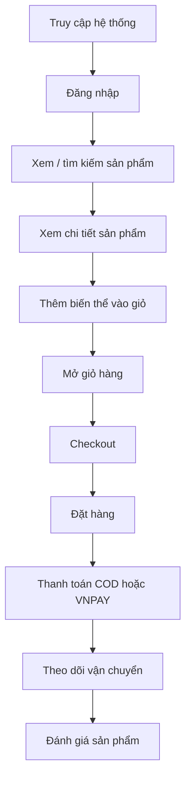
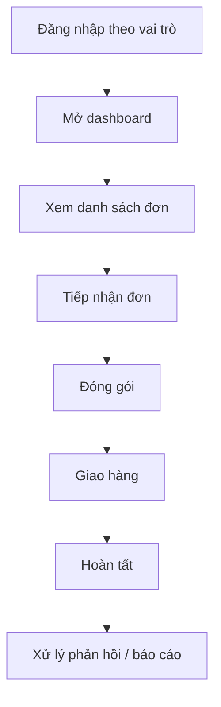
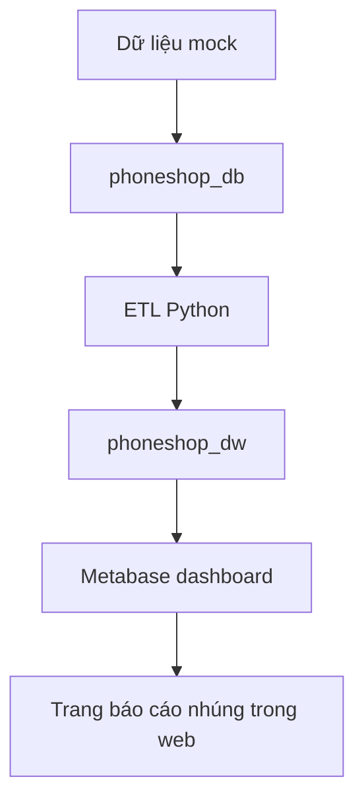

# Tóm Tắt Dự Án PhoneShop

Tài liệu này là bản tổng kết đầy đủ của dự án, từ yêu cầu nghiệp vụ, luồng chức năng, thiết kế hệ thống, đến công nghệ và triển khai.

---

## 1. Tổng Quan Dự Án

PhoneShop là một hệ thống thương mại điện tử bán điện thoại theo mô hình phân quyền theo vai trò.

Dự án gồm 2 phần chính:

- `mobile/`: web app Spring Boot cho nghiệp vụ bán hàng
- `dwh/`, `mockdata.py`, `etl_to_dwh.py`: khối dữ liệu và BI

Ba vai trò chính trong hệ thống:

- Khách hàng
- Nhân viên
- Quản lý

Use case `U14 - Xem báo cáo kinh doanh` thuộc phần BI / reporting.

---

## 2. Danh Sách Use Case

### 2.1. Use Case của Khách hàng

- U1 - Đăng nhập
- U2 - Đăng xuất
- U3 - Đăng ký tài khoản
- U4 - Xem và tìm kiếm sản phẩm
- U5 - Thêm biến thể vào giỏ và quản lý giỏ hàng
- U6 - Thanh toán và đặt hàng
- U7 - Thanh toán COD hoặc VNPAY
- U8 - Theo dõi vận chuyển
- U9 - Hủy đơn khi được phép
- U10 - Đánh giá sản phẩm đã mua
- U11 - Cập nhật thông tin cá nhân và địa chỉ

### 2.2. Use Case của Nhân viên

- U12 - Tiếp nhận và xử lý đơn hàng
- U15 - Xử lý phản hồi của khách hàng

### 2.3. Use Case của Quản lý

- U13 - Quản lý sản phẩm
- U14 - Xem báo cáo kinh doanh
- U16 - Xác thực giao dịch thanh toán
- U17 - Cập nhật trạng thái giao hàng

---

## 3. Activity Diagram / Luồng Hoạt Động

### 3.1. Luồng của Khách hàng



### 3.2. Luồng của Nhân viên / Quản lý



### 3.3. Luồng BI



---

## 4. Sequence Diagram / Luồng Tương Tác

Phần sequence chi tiết theo đúng mẫu Buổi 3 đã được tách riêng sang file:

- [SEQUENCE_DIAGRAMS.md](SEQUENCE_DIAGRAMS.md)

Trong file đó có đầy đủ sequence cho toàn bộ use case, theo cấu trúc:

- Actor
- Boundary
- Control
- Entity
- Thông điệp và nhánh `alt`, `opt`, `loop` khi cần

---

## 5. Sitemap / Cấu Trúc Trang

### 5.1. Công khai

- `/`
- `/products`
- `/products/{id}`
- `/login`
- `/register`

### 5.2. Khách hàng

- `/cart`
- `/orders`
- `/orders/{id}`
- `/orders/{id}/cancel`
- `/orders/{id}/tracking`
- `/payments/{id}`
- `/payments/{id}/vnpay`
- `/payments/{id}/vnpay/mock`
- `/payments/vnpay/return`
- `/profile`
- `/profile/addresses`
- `/profile/feedbacks`
- `/profile/password`

### 5.3. Nhân viên

- `/employee/dashboard`
- `/employee/orders`
- `/employee/orders/{id}`
- `/employee/feedbacks`

### 5.4. Quản lý

- `/admin/dashboard`
- `/admin/products`
- `/admin/products/create`
- `/admin/products/{id}`
- `/admin/products/{id}/edit`
- `/admin/employees`
- `/admin/employees/create`
- `/admin/employees/{id}`
- `/admin/employees/{id}/edit`
- `/admin/orders`
- `/admin/orders/{id}`
- `/admin/reports`

---

## 6. Wireframe / Gợi Ý Bố Cục Màn Hình

### 6.1. Product Detail

- Khối hero với tên sản phẩm, hãng, mô tả ngắn
- Card biến thể có giá, tồn kho, nút thêm vào giỏ
- Khung tóm tắt ở bên phải

### 6.2. Cart

- Cột trái: danh sách sản phẩm, nút tăng giảm số lượng
- Cột phải: summary đơn hàng và nút sang checkout

### 6.3. Checkout

- Cột trái: form giao hàng
- Cột phải: summary giỏ hàng và lựa chọn thanh toán

### 6.4. Order Detail

- Hero trên cùng với chip trạng thái
- Timeline tiến trình đơn hàng
- Bảng item
- Khối lịch sử thanh toán
- Khối hành động nhanh

### 6.5. Payment

- Hero trạng thái thanh toán
- Timeline tiến trình
- Một nút hành động chính để tiếp tục thanh toán
- Màn mock local cho môi trường dev

### 6.6. Shipment Tracking

- Hero trạng thái đơn và trạng thái giao hàng
- Tóm tắt vận chuyển
- Timeline tracking
- Nút refresh đồng bộ GHN

### 6.7. Manager Dashboard

- Hero lớn
- 4 thẻ chính:
  - Orders
  - Products
  - Employees
  - Reports

### 6.8. Reports

- Dashboard BI nhúng bằng iframe
- KPI cards
- Biểu đồ doanh thu theo tháng
- Bảng top sản phẩm
- Bảng tồn kho thấp

---

## 7. Công Nghệ Sử Dụng

### 7.1. Backend

- Java 17
- Spring Boot
- Spring MVC
- Spring Security
- Spring Data JPA
- Thymeleaf
- MySQL

### 7.2. Dữ liệu và BI

- Python ETL
- MySQL OLTP (`phoneshop_db`)
- MySQL DWH (`phoneshop_dw`)
- Metabase để nhúng dashboard

### 7.3. Frontend

- Thymeleaf templates
- Bootstrap 5
- CSS tùy biến responsive
- Chart.js cho một số biểu đồ nội bộ

### 7.4. Tích hợp ngoài

- VNPay sandbox / mock mode
- GHN sandbox / fallback mode

---

## 8. Triển Khai / Chạy Hệ Thống

### 8.1. OLTP cục bộ

1. Khởi động MySQL.
2. Tạo hoặc load database `phoneshop_db`.
3. Chạy `mockdata.py` để sinh dữ liệu mẫu.

### 8.2. Warehouse

1. Tạo `phoneshop_dw` từ `dwh/phoneshop_dw_schema.sql`.
2. Chạy `etl_to_dwh.py`.
3. Nạp dữ liệu phân tích vào DWH.

### 8.3. Web App

1. Chạy ứng dụng Spring Boot trong `mobile/`.
2. Mở `http://localhost:8080`.
3. Kiểm tra luồng customer, employee, manager.

### 8.4. BI

1. Chạy Metabase local hoặc trên server.
2. Kết nối tới `phoneshop_dw`.
3. Tạo dashboard và các chart.
4. Dán URL embed vào `bi.dashboard-url`.
5. Mở `/admin/reports`.

---

## 9. Cấu Trúc Package

### `com.ecommerce.mobile.config`

- Cấu hình bảo mật
- Cấu hình seed / fix
- Cấu hình VNPay và GHN
- Handler điều hướng theo role

### `com.ecommerce.mobile.controller`

- Route HTTP cho customer, employee, manager, payment, tracking, reports

### `com.ecommerce.mobile.entity`

- Các JPA entity cho user, product, cart, order, payment, shipment, review, feedback

### `com.ecommerce.mobile.repository`

- Tầng truy cập dữ liệu

### `com.ecommerce.mobile.service`

- Logic nghiệp vụ cho cart, order, payment, shipping, reports, review, feedback, manager actions

### `com.ecommerce.mobile.dto`

- Form, request, response, view model

### `com.ecommerce.mobile.enums`

- Các trạng thái cho order, payment, shipment, product, feedback

### `com.ecommerce.mobile.util`

- Helper cho hiển thị và xử lý phụ trợ

### `src/main/resources/templates`

- Giao diện Thymeleaf

### `src/main/resources/static`

- CSS, JS, assets

---

## 10. Câu Chuyện Phát Triển Dự Án

Dự án này đã đi qua 4 giai đoạn:

1. Xây core web app OLTP
2. Tạo dữ liệu mẫu và nền tảng warehouse
3. Polish UI và ổn định backend
4. Tích hợp BI qua Metabase

Từ một web shop ban đầu, hệ thống đã mở rộng thành:

- luồng nghiệp vụ vận hành
- luồng nhân viên
- luồng quản lý
- warehouse phân tích
- dashboard nhúng trong web app

Toàn bộ kiến trúc có thể tóm gọn như sau:

```text
Mock data -> OLTP -> ETL -> DWH -> Metabase -> trang báo cáo nhúng
```

---

## 11. Kết Luận

PhoneShop không chỉ là một web bán hàng đơn lẻ.  
Nó là một hệ thống gồm:

- ứng dụng vận hành
- quản trị nghiệp vụ
- warehouse dữ liệu
- BI / dashboard

Tài liệu này là bản tổng hợp để:

- hiểu cấu trúc dự án
- viết báo cáo
- ôn lại sau khi nộp
- làm nền cho các sprint tiếp theo
