# Biểu Đồ Tuần Tự Chi Tiết Theo Use Case

Tài liệu này bám theo đúng mẫu **Buổi 3: Thiết kế hệ thống - Biểu đồ tuần tự chi tiết**.

Mỗi use case đều thể hiện đủ các nhóm đối tượng:

- **Actor**: tác nhân bên ngoài
- **Boundary**: lớp giao diện / form / page
- **Control**: controller / service điều phối
- **Entity**: entity / dữ liệu / database

---

## U1 - Đăng nhập

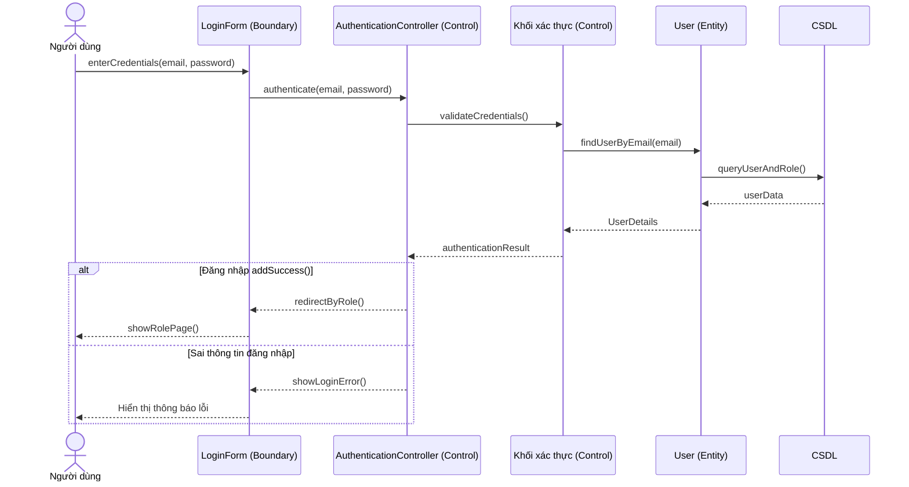

## U2 - Đăng xuất

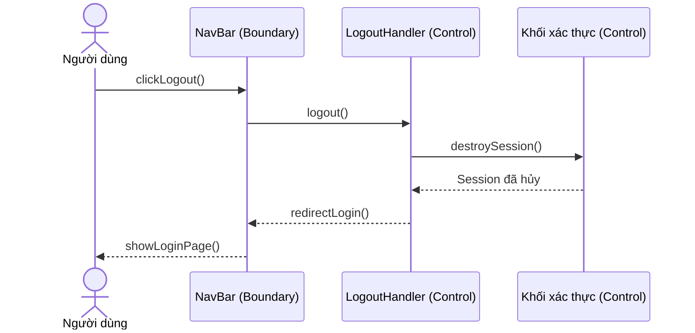

## U3 - Đăng ký tài khoản

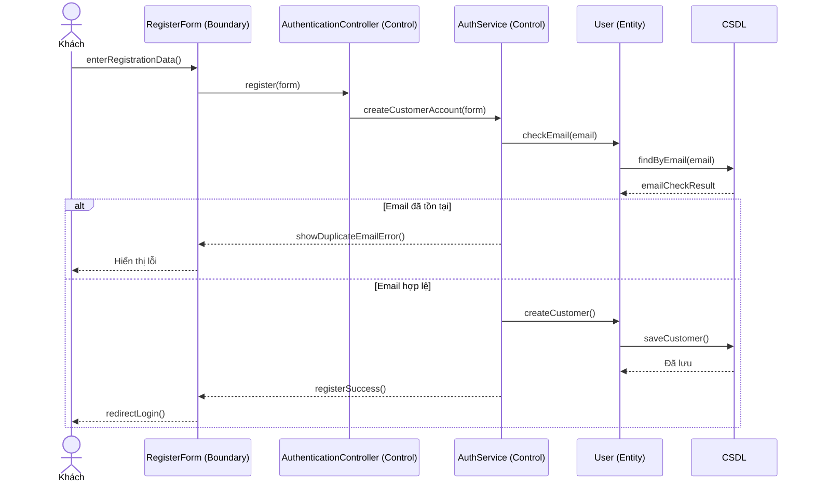

## U4 - Xem và tìm kiếm sản phẩm

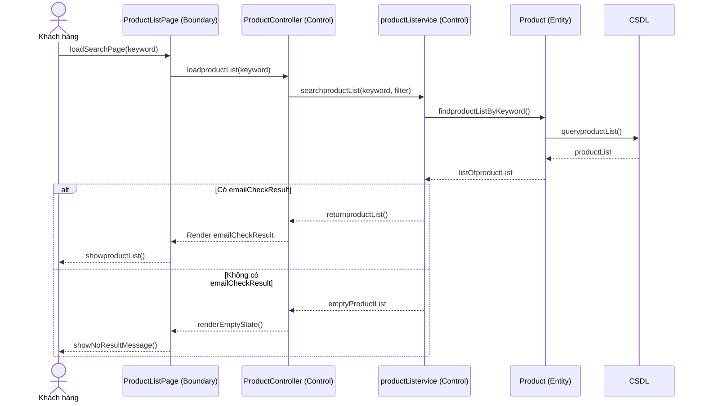

## U5 - Thêm vào giỏ và quản lý giỏ hàng

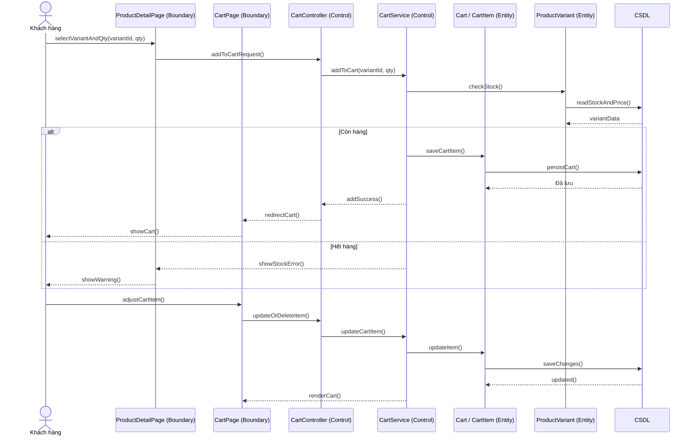

## U6 - Thanh toán và đặt hàng

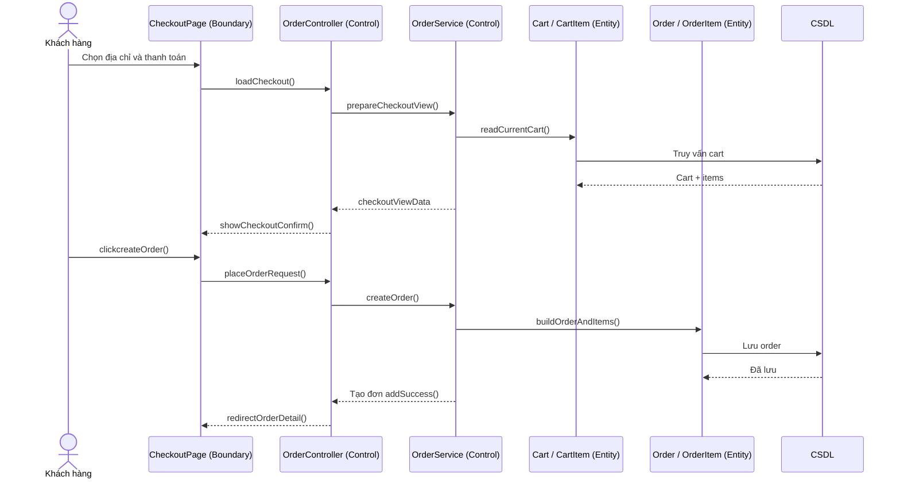

## U7 - Thanh toán COD hoặc VNPAY

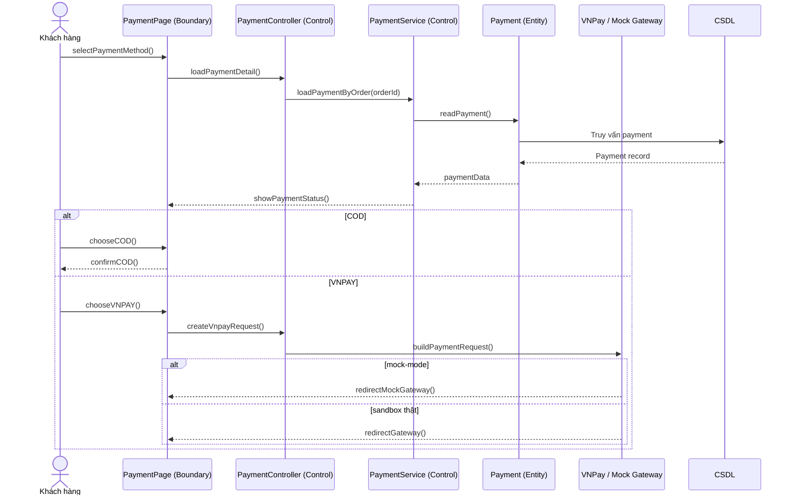

## U8 - Theo dõi vận chuyển

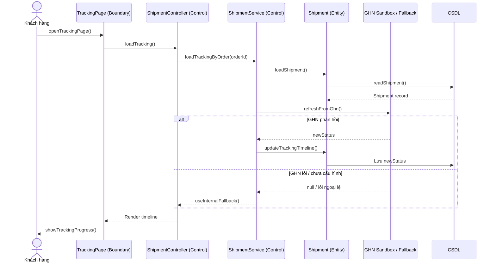

## U9 - Hủy đơn khi được phép

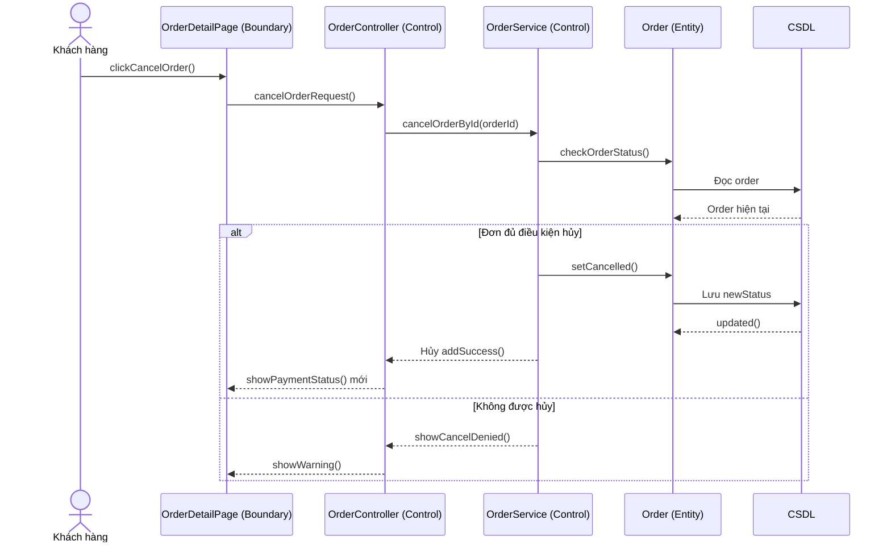

## U10 - Đánh giá sản phẩm đã mua

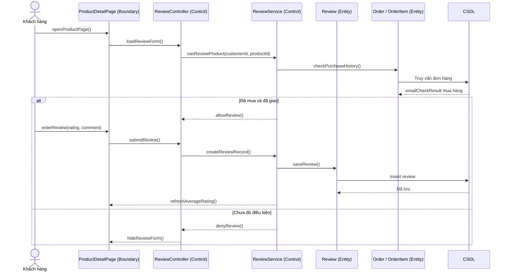

## U11 - Cập nhật thông tin cá nhân và địa chỉ

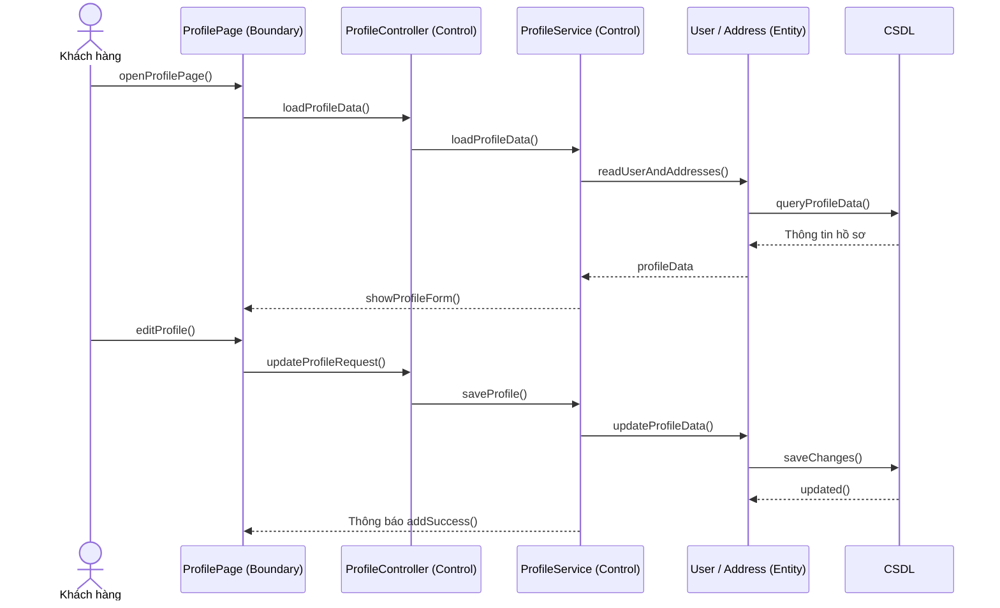

## U12 - Tiếp nhận và xử lý đơn hàng

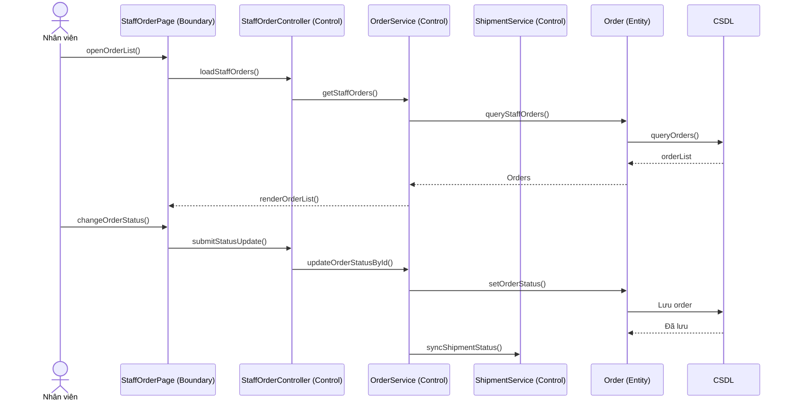

## U13 - Quản lý sản phẩm

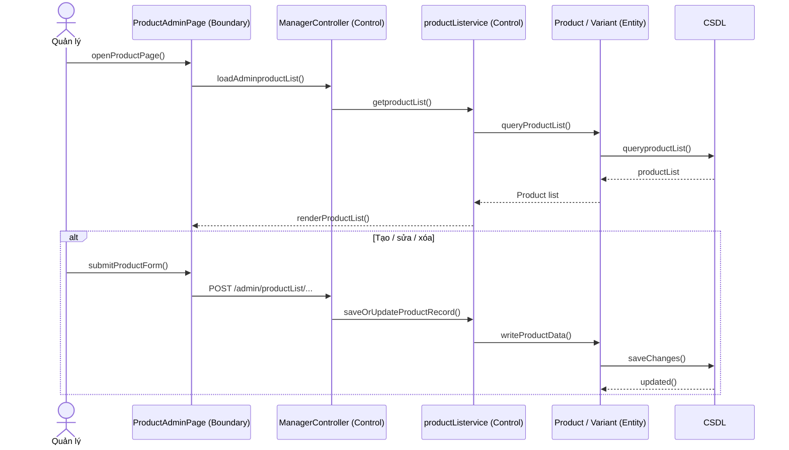

## U14 - Xem báo cáo kinh doanh

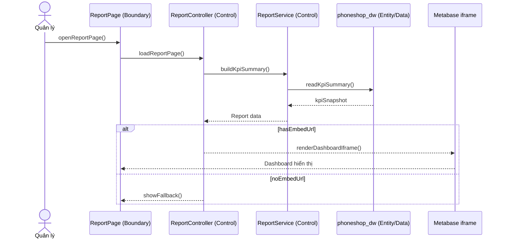

## U15 - Xử lý phản hồi của khách hàng

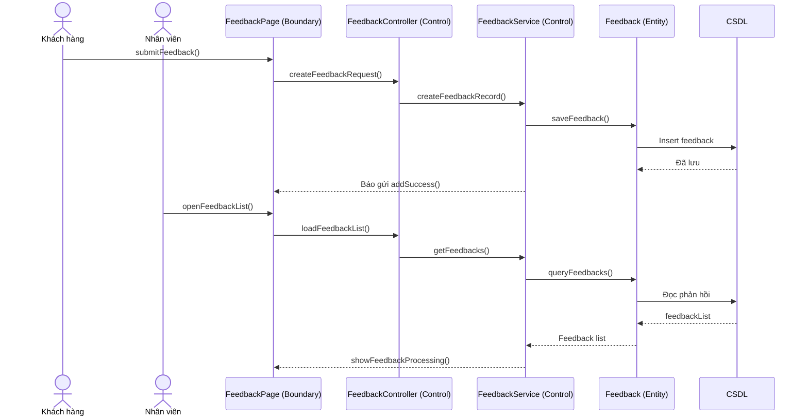

## U16 - Xác thực giao dịch thanh toán

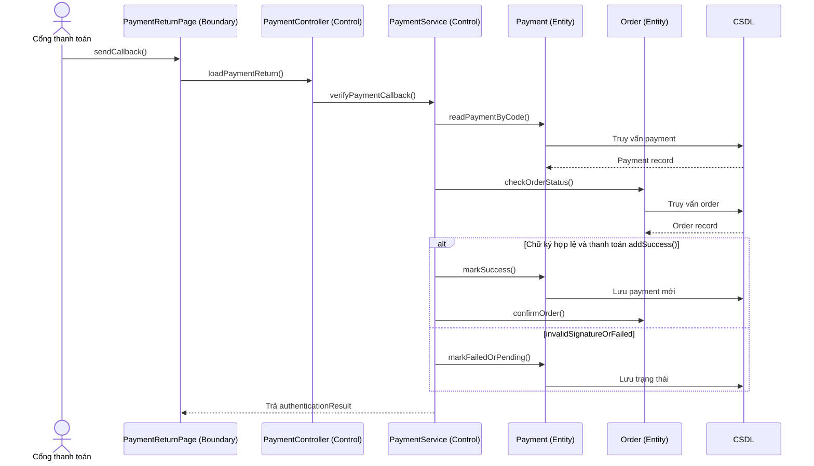

## U17 - Cập nhật lộ trình vận chuyển

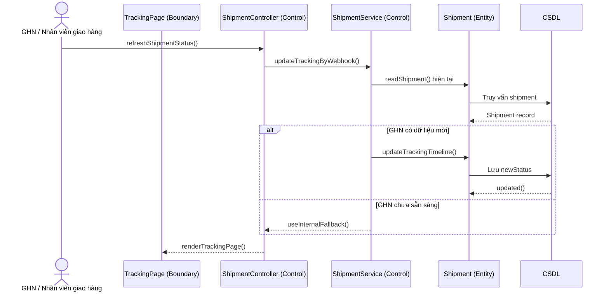

---

## Tự Kiểm Tra

Nếu lấy bất kỳ use case nào ở trên để so với sequence:

- Actor đã xuất hiện chưa?
- Boundary có đúng màn hình / form liên quan không?
- Control có điều phối đúng luồng không?
- Entity có được truy cập khi cần không?
- Nhánh `alt`, `opt`, `loop` có được thể hiện cho các trường hợp rẽ nhánh không?

Nếu câu trả lời là có, thì sequence diagram đã bám đúng yêu cầu của Buổi 3.

