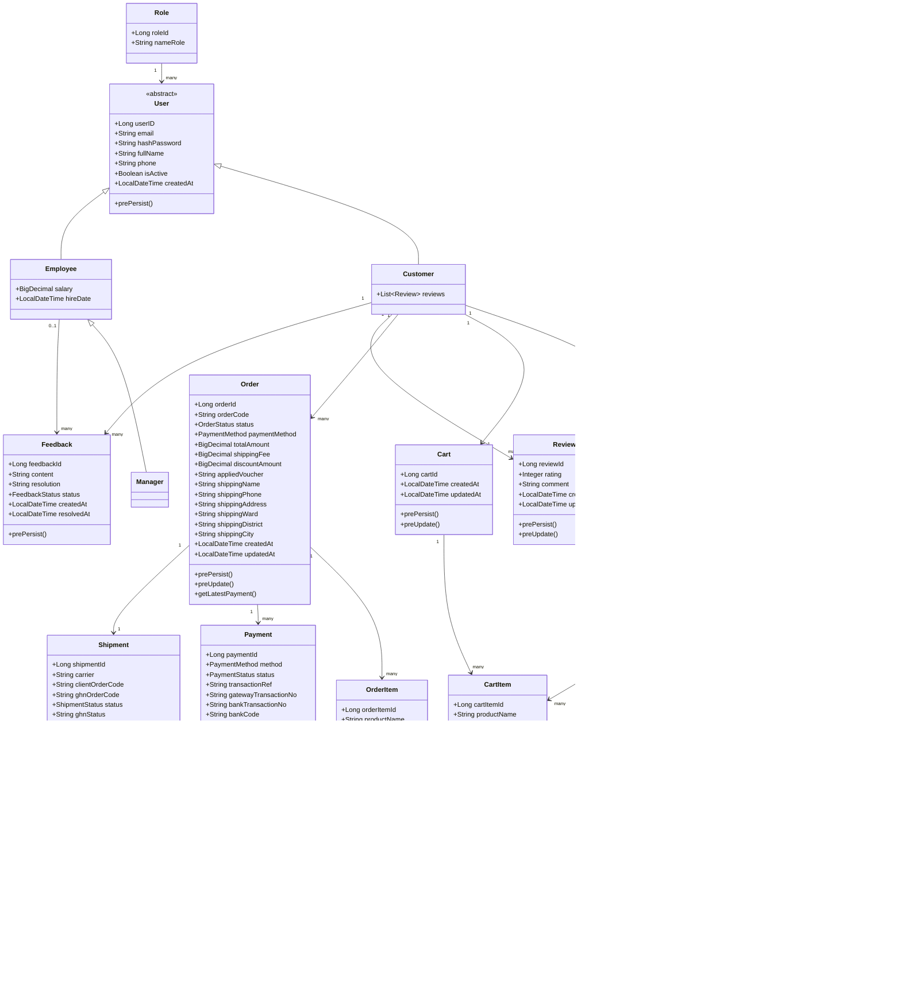

# Buổi 4 - Thiết Kế Hệ Thống

Tài liệu này tổng kết ba phần chính của Buổi 4:

1. Biểu đồ lớp
2. Thiết kế cơ sở dữ liệu
3. Giao diện dự kiến

Tài liệu được viết theo đúng cấu trúc của dự án PhoneShop để có thể dùng trực tiếp trong báo cáo.

---

## 1. Biểu Đồ Lớp Của Hệ Thống

### 1.1. Mục tiêu

Biểu đồ lớp mô tả các lớp chính của hệ thống, các thuộc tính quan trọng, phương thức quan trọng và quan hệ giữa các lớp.

Trong dự án này, lớp được chia thành 3 nhóm:

- **Lớp thực thể**: lưu trữ dữ liệu nghiệp vụ
- **Lớp điều khiển / dịch vụ**: xử lý logic
- **Lớp giao diện**: màn hình, form, trang web

### 1.2. Biểu đồ lớp tổng quát

### 1.3. Nhóm lớp điều khiển và dịch vụ

| Nhóm chức năng | Lớp chính | Vai trò |
|---|---|---|
| Xác thực | `AuthController`, `CustomerService` | Đăng nhập, đăng xuất, đăng ký |
| Sản phẩm | `ProductController`, `ProductService` | Danh sách, chi tiết, tìm kiếm |
| Giỏ hàng | `CartController`, `CartService` | Thêm, sửa, xóa cart item |
| Đơn hàng | `OrderController`, `OrderService` | Checkout, đặt hàng, hủy đơn |
| Thanh toán | `PaymentController`, `PaymentService`, `VnpayService` | COD, VNPAY, xác thực callback |
| Vận chuyển | `ShipmentController`, `ShipmentService`, `GhnClient`, `GhnWebhookController` | Tracking, đồng bộ GHN |
| Hồ sơ | `ProfileController`, `AddressController` | Cập nhật hồ sơ và địa chỉ |
| Đánh giá | `ReviewController`, `ReviewService` | Review sản phẩm đã mua |
| Phản hồi | `FeedbackController`, `FeedbackService` | Gửi và xử lý feedback |
| Quản lý | `ManagerController`, `ManagerEmployeeController`, `StaffOrderController`, `DashboardController` | Quản trị sản phẩm, nhân viên, đơn hàng |
| Báo cáo | `ReportController`, `ReportService` | Tổng hợp KPI, nhúng Metabase |

---

## 2. Thiết Kế Cơ Sở Dữ Liệu

### 2.1. Mục tiêu

Mô hình dữ liệu được chia thành 2 phần:

- **OLTP**: phục vụ vận hành website
- **DWH**: phục vụ phân tích và báo cáo BI

### 2.2. CSDL nghiệp vụ OLTP

#### Bảng `roles`

| Cột | Kiểu dữ liệu | Ràng buộc | Mô tả |
|---|---|---|---|
| role_id | BIGINT | PRIMARY KEY, AUTO_INCREMENT | Mã vai trò |
| name_role | VARCHAR(50) | NOT NULL, UNIQUE | Tên vai trò |

#### Bảng `users`

| Cột | Kiểu dữ liệu | Ràng buộc | Mô tả |
|---|---|---|---|
| user_id | BIGINT | PRIMARY KEY, AUTO_INCREMENT | Mã người dùng |
| dtype | VARCHAR(31) | NOT NULL | Phân biệt Customer / Employee / Manager |
| email | VARCHAR(100) | NOT NULL, UNIQUE | Email đăng nhập |
| password_hash | VARCHAR(255) | NOT NULL | Mật khẩu đã mã hóa |
| full_name | VARCHAR(100) | NOT NULL | Họ tên |
| phone | VARCHAR(15) | NULL | Số điện thoại |
| is_active | BOOLEAN | NULL | Trạng thái tài khoản |
| created_at | DATETIME | NULL | Thời gian tạo |
| role_id | BIGINT | FOREIGN KEY REFERENCES roles(role_id) | Vai trò |

#### Bảng `address`

| Cột | Kiểu dữ liệu | Ràng buộc | Mô tả |
|---|---|---|---|
| address_id | BIGINT | PRIMARY KEY, AUTO_INCREMENT | Mã địa chỉ |
| user_id | BIGINT | FOREIGN KEY REFERENCES users(user_id) | Khách hàng sở hữu địa chỉ |
| street | VARCHAR(255) | NULL | Số nhà / đường |
| ward | VARCHAR(100) | NULL | Phường / xã |
| district | VARCHAR(100) | NULL | Quận / huyện |
| city | VARCHAR(100) | NULL | Tỉnh / thành phố |
| phone | VARCHAR(15) | NULL | SĐT nhận hàng |
| is_default | BOOLEAN | NOT NULL DEFAULT FALSE | Địa chỉ mặc định |
| created_at | DATETIME | NULL | Ngày tạo |

#### Bảng `categories`

| Cột | Kiểu dữ liệu | Ràng buộc | Mô tả |
|---|---|---|---|
| category_id | BIGINT | PRIMARY KEY, AUTO_INCREMENT | Mã danh mục |
| name | VARCHAR(255) | NOT NULL | Tên danh mục |
| slug | VARCHAR(255) | UNIQUE | Đường dẫn thân thiện |
| is_active | BOOLEAN | NULL | Trạng thái hiển thị |
| parent_id | BIGINT | FOREIGN KEY REFERENCES categories(category_id) | Danh mục cha |

#### Bảng `products`

| Cột | Kiểu dữ liệu | Ràng buộc | Mô tả |
|---|---|---|---|
| product_id | BIGINT | PRIMARY KEY, AUTO_INCREMENT | Mã sản phẩm |
| category_id | BIGINT | FOREIGN KEY REFERENCES categories(category_id) | Danh mục |
| name | VARCHAR(255) | NOT NULL | Tên sản phẩm |
| brand | VARCHAR(255) | NULL | Hãng |
| description | TEXT | NULL | Mô tả |
| status | VARCHAR(20) | NOT NULL | ACTIVE / INACTIVE |
| created_at | DATETIME | NULL | Ngày tạo |

#### Bảng `product_variants`

| Cột | Kiểu dữ liệu | Ràng buộc | Mô tả |
|---|---|---|---|
| variant_id | BIGINT | PRIMARY KEY, AUTO_INCREMENT | Mã biến thể |
| product_id | BIGINT | FOREIGN KEY REFERENCES products(product_id) | Sản phẩm cha |
| storage_gb | INT | NULL | Dung lượng |
| price | DECIMAL(19,2) | NOT NULL | Giá bán |
| import_price | DECIMAL(19,2) | NOT NULL | Giá nhập |
| stock_qty | INT | NOT NULL | Số lượng tồn kho |
| sku | VARCHAR(255) | NULL | Mã SKU |

#### Bảng `product_images`

| Cột | Kiểu dữ liệu | Ràng buộc | Mô tả |
|---|---|---|---|
| image_id | BIGINT | PRIMARY KEY, AUTO_INCREMENT | Mã ảnh |
| variant_id | BIGINT | FOREIGN KEY REFERENCES product_variants(variant_id) | Biến thể |
| url | VARCHAR(255) | NULL | Đường dẫn ảnh |
| is_primary | BOOLEAN | NULL | Ảnh chính |

#### Bảng `carts`

| Cột | Kiểu dữ liệu | Ràng buộc | Mô tả |
|---|---|---|---|
| cart_id | BIGINT | PRIMARY KEY, AUTO_INCREMENT | Mã giỏ hàng |
| user_id | BIGINT | FOREIGN KEY REFERENCES users(user_id), UNIQUE | Khách hàng |
| created_at | DATETIME | NULL | Ngày tạo |
| updated_at | DATETIME | NULL | Ngày cập nhật |

#### Bảng `cart_items`

| Cột | Kiểu dữ liệu | Ràng buộc | Mô tả |
|---|---|---|---|
| cart_item_id | BIGINT | PRIMARY KEY, AUTO_INCREMENT | Mã dòng giỏ |
| cart_id | BIGINT | FOREIGN KEY REFERENCES carts(cart_id) | Giỏ hàng |
| variant_id | BIGINT | FOREIGN KEY REFERENCES product_variants(variant_id) | Biến thể |
| product_name | VARCHAR(255) | NOT NULL | Tên sản phẩm lúc thêm vào giỏ |
| unit_price | DECIMAL(19,2) | NOT NULL | Đơn giá |
| quantity | INT | NOT NULL | Số lượng |
| subtotal | DECIMAL(19,2) | NOT NULL | Thành tiền |
| added_at | DATETIME | NULL | Ngày thêm |

#### Bảng `orders`

| Cột | Kiểu dữ liệu | Ràng buộc | Mô tả |
|---|---|---|---|
| order_id | BIGINT | PRIMARY KEY, AUTO_INCREMENT | Mã đơn hàng |
| user_id | BIGINT | FOREIGN KEY REFERENCES users(user_id) | Khách hàng |
| order_code | VARCHAR(40) | NOT NULL, UNIQUE | Mã đơn |
| status | VARCHAR(20) | NOT NULL | PENDING / CONFIRMED / PACKING / SHIPPING / DELIVERED / CANCELLED |
| payment_method | VARCHAR(20) | NOT NULL | COD / VN_PAY |
| total_amount | DECIMAL(19,2) | NOT NULL | Tổng tiền |
| shipping_fee | DECIMAL(19,2) | NOT NULL | Phí ship |
| discount_amount | DECIMAL(19,2) | NOT NULL | Giảm giá |
| applied_voucher | VARCHAR(100) | NULL | Mã voucher |
| shipping_name | VARCHAR(100) | NOT NULL | Tên người nhận |
| shipping_phone | VARCHAR(20) | NOT NULL | SĐT nhận hàng |
| shipping_address | VARCHAR(255) | NOT NULL | Địa chỉ |
| shipping_ward | VARCHAR(100) | NULL | Phường / xã |
| shipping_district | VARCHAR(100) | NULL | Quận / huyện |
| shipping_city | VARCHAR(100) | NOT NULL | Tỉnh / thành phố |
| created_at | DATETIME | NULL | Ngày tạo |
| updated_at | DATETIME | NULL | Ngày cập nhật |

#### Bảng `order_items`

| Cột | Kiểu dữ liệu | Ràng buộc | Mô tả |
|---|---|---|---|
| order_item_id | BIGINT | PRIMARY KEY, AUTO_INCREMENT | Mã chi tiết đơn |
| order_id | BIGINT | FOREIGN KEY REFERENCES orders(order_id) | Đơn hàng |
| variant_id | BIGINT | FOREIGN KEY REFERENCES product_variants(variant_id) | Biến thể |
| product_name | VARCHAR(255) | NOT NULL | Tên sản phẩm |
| unit_price | DECIMAL(19,2) | NOT NULL | Đơn giá |
| quantity | INT | NOT NULL | Số lượng |
| subtotal | DECIMAL(19,2) | NOT NULL | Thành tiền |

#### Bảng `payments`

| Cột | Kiểu dữ liệu | Ràng buộc | Mô tả |
|---|---|---|---|
| payment_id | BIGINT | PRIMARY KEY, AUTO_INCREMENT | Mã thanh toán |
| order_id | BIGINT | FOREIGN KEY REFERENCES orders(order_id) | Đơn hàng |
| method | VARCHAR(20) | NOT NULL | COD / VN_PAY |
| status | VARCHAR(20) | NOT NULL | PENDING / SUCCESS / FAILED / REFUNDED |
| transaction_ref | VARCHAR(100) | UNIQUE | Mã giao dịch |
| gateway_transaction_no | VARCHAR(50) | NULL | Mã giao dịch từ cổng |
| bank_transaction_no | VARCHAR(50) | NULL | Mã giao dịch ngân hàng |
| bank_code | VARCHAR(20) | NULL | Mã ngân hàng |
| card_type | VARCHAR(20) | NULL | Loại thẻ |
| response_code | VARCHAR(10) | NULL | Mã phản hồi |
| transaction_status | VARCHAR(10) | NULL | Trạng thái giao dịch |
| pay_date | VARCHAR(20) | NULL | Ngày thanh toán |
| response_message | VARCHAR(255) | NULL | Thông báo từ cổng |
| paid_at | DATETIME | NULL | Thời điểm thanh toán |
| created_at | DATETIME | NULL | Ngày tạo |
| updated_at | DATETIME | NULL | Ngày cập nhật |

#### Bảng `shipments`

| Cột | Kiểu dữ liệu | Ràng buộc | Mô tả |
|---|---|---|---|
| shipment_id | BIGINT | PRIMARY KEY, AUTO_INCREMENT | Mã vận đơn |
| order_id | BIGINT | FOREIGN KEY REFERENCES orders(order_id), UNIQUE | Đơn hàng |
| carrier | VARCHAR(30) | NOT NULL | Đơn vị giao hàng |
| client_order_code | VARCHAR(80) | UNIQUE | Mã đơn nội bộ |
| ghn_order_code | VARCHAR(80) | UNIQUE | Mã đơn GHN |
| status | VARCHAR(30) | NOT NULL | PENDING / PICKED_UP / IN_TRANSIT / DELIVERED / CANCELLED / RETURNING / RETURNED / EXCEPTION |
| ghn_status | VARCHAR(50) | NULL | Trạng thái từ GHN |
| status_message | VARCHAR(255) | NULL | Ghi chú trạng thái |
| tracking_url | VARCHAR(255) | NULL | Link theo dõi |
| expected_delivery_at | DATETIME | NULL | Dự kiến giao |
| last_synced_at | DATETIME | NULL | Lần đồng bộ cuối |
| raw_payload | LONGTEXT | NULL | Dữ liệu thô từ GHN |
| created_at | DATETIME | NULL | Ngày tạo |
| updated_at | DATETIME | NULL | Ngày cập nhật |

#### Bảng `shipment_events`

| Cột | Kiểu dữ liệu | Ràng buộc | Mô tả |
|---|---|---|---|
| event_id | BIGINT | PRIMARY KEY, AUTO_INCREMENT | Mã sự kiện |
| shipment_id | BIGINT | FOREIGN KEY REFERENCES shipments(shipment_id) | Vận đơn |
| shipment_status | VARCHAR(30) | NULL | Trạng thái chuẩn |
| ghn_status | VARCHAR(60) | NULL | Trạng thái GHN |
| event_type | VARCHAR(60) | NULL | Loại sự kiện |
| warehouse | VARCHAR(255) | NULL | Kho / bưu cục |
| description | VARCHAR(500) | NULL | Mô tả |
| occurred_at | DATETIME | NULL | Thời điểm xảy ra |
| raw_payload | LONGTEXT | NULL | Dữ liệu thô |

#### Bảng `reviews`

| Cột | Kiểu dữ liệu | Ràng buộc | Mô tả |
|---|---|---|---|
| review_id | BIGINT | PRIMARY KEY, AUTO_INCREMENT | Mã review |
| user_id | BIGINT | FOREIGN KEY REFERENCES users(user_id) | Khách hàng |
| product_id | BIGINT | FOREIGN KEY REFERENCES products(product_id) | Sản phẩm |
| rating | INT | NOT NULL | Điểm đánh giá |
| comment | VARCHAR(1000) | NULL | Nhận xét |
| created_at | DATETIME | NULL | Ngày tạo |
| updated_at | DATETIME | NULL | Ngày cập nhật |
| UNIQUE(user_id, product_id) | - | - | Mỗi khách chỉ review 1 lần cho 1 sản phẩm |

#### Bảng `feedback`

| Cột | Kiểu dữ liệu | Ràng buộc | Mô tả |
|---|---|---|---|
| feedback_id | BIGINT | PRIMARY KEY, AUTO_INCREMENT | Mã phản hồi |
| customer_id | BIGINT | FOREIGN KEY REFERENCES users(user_id) | Khách hàng |
| employee_id | BIGINT | FOREIGN KEY REFERENCES users(user_id) | Nhân viên xử lý |
| content | VARCHAR(2000) | NOT NULL | Nội dung phản hồi |
| resolution | VARCHAR(2000) | NULL | Hướng xử lý |
| status | VARCHAR(20) | NOT NULL | PENDING / IN_PROGRESS / RESOLVED |
| created_at | DATETIME | NULL | Ngày tạo |
| resolved_at | DATETIME | NULL | Ngày xử lý xong |

### 2.3. CSDL phân tích DWH

#### Bảng `Dim_Date`

| Cột | Kiểu dữ liệu | Mô tả |
|---|---|---|
| date_key | INT | Khóa ngày |
| full_date | DATE | Ngày đầy đủ |
| day | TINYINT | Ngày trong tháng |
| month | TINYINT | Tháng |
| month_name | VARCHAR(20) | Tên tháng |
| quarter | TINYINT | Quý |
| year | SMALLINT | Năm |
| day_of_week | TINYINT | Thứ trong tuần |
| day_name | VARCHAR(20) | Tên thứ |
| is_weekend | BOOLEAN | Có phải cuối tuần không |
| month_key | INT | Khóa tháng |

#### Bảng `Dim_Product`

| Cột | Kiểu dữ liệu | Mô tả |
|---|---|---|
| product_key | BIGINT | Khóa sản phẩm |
| product_name | VARCHAR(255) | Tên sản phẩm |
| variant_name | VARCHAR(255) | Tên biến thể |
| category_name | VARCHAR(100) | Danh mục |
| parent_category | VARCHAR(100) | Danh mục cha |
| color | VARCHAR(50) | Màu sắc |
| storage | VARCHAR(20) | Dung lượng |
| current_price | DECIMAL(19,2) | Giá bán |
| import_price | DECIMAL(19,2) | Giá nhập |
| current_stock | INT | Tồn kho |
| sku | VARCHAR(255) | Mã SKU |
| status | VARCHAR(20) | Trạng thái |

#### Bảng `Dim_Customer`

| Cột | Kiểu dữ liệu | Mô tả |
|---|---|---|
| customer_key | BIGINT | Khóa khách hàng |
| full_name | VARCHAR(255) | Họ tên |
| email | VARCHAR(255) | Email |
| role_name | VARCHAR(50) | Vai trò |
| city | VARCHAR(100) | Thành phố |
| registered_at | DATETIME | Ngày đăng ký |

#### Bảng `Dim_Month`

| Cột | Kiểu dữ liệu | Mô tả |
|---|---|---|
| month_key | INT | Khóa tháng |
| year | SMALLINT | Năm |
| month | TINYINT | Tháng |
| month_name | VARCHAR(20) | Tên tháng |
| quarter | TINYINT | Quý |
| month_label | VARCHAR(20) | Nhãn tháng |
| month_sort | INT | Khóa sắp xếp |

#### Bảng `Fact_Sales`

| Cột | Kiểu dữ liệu | Mô tả |
|---|---|---|
| sales_key | BIGINT | Khóa fact |
| date_key | INT | FK -> Dim_Date |
| customer_key | BIGINT | FK -> Dim_Customer |
| product_key | BIGINT | FK -> Dim_Product |
| order_id | BIGINT | Mã đơn |
| order_status | VARCHAR(20) | Trạng thái đơn |
| payment_method | VARCHAR(20) | Phương thức thanh toán |
| is_voucher_applied | BOOLEAN | Có dùng voucher không |
| lead_time_days | DECIMAL(5,1) | Số ngày xử lý |
| quantity | INT | Số lượng |
| unit_price | DECIMAL(19,2) | Đơn giá |
| revenue | DECIMAL(19,2) | Doanh thu |
| cogs | DECIMAL(19,2) | Giá vốn |
| gross_profit | DECIMAL(19,2) | Lợi nhuận gộp |
| discount_amount | DECIMAL(19,2) | Giảm giá |
| shipping_fee | DECIMAL(19,2) | Phí ship |

#### Bảng `Fact_Reviews`

| Cột | Kiểu dữ liệu | Mô tả |
|---|---|---|
| review_key | BIGINT | Khóa fact |
| date_key | INT | FK -> Dim_Date |
| customer_key | BIGINT | FK -> Dim_Customer |
| product_key | BIGINT | FK -> Dim_Product |
| order_id | BIGINT | Mã đơn |
| rating | TINYINT | Điểm đánh giá |

#### Bảng `Fact_OPEX`

| Cột | Kiểu dữ liệu | Mô tả |
|---|---|---|
| opex_key | INT | Khóa fact |
| month_key | INT | FK -> Dim_Month |
| year | SMALLINT | Năm |
| month | TINYINT | Tháng |
| total_salaries | DECIMAL(19,2) | Tổng lương |
| other_opex | DECIMAL(19,2) | Chi phí khác |
| total_opex | DECIMAL(19,2) | Tổng OPEX |

---

## 3. Giao Diện Dự Kiến Của Website

### 3.1. Trang chủ

- Thanh điều hướng trên cùng
- Hero giới thiệu thương hiệu
- Nút vào danh sách sản phẩm
- Khối sản phẩm nổi bật
- Footer đơn giản

### 3.2. Trang danh sách sản phẩm

- Ô tìm kiếm
- Bộ lọc nhanh theo hãng / danh mục
- Lưới card sản phẩm responsive
- Phân trang

### 3.3. Trang chi tiết sản phẩm

- Breadcrumb
- Hero giới thiệu sản phẩm
- Thông tin danh mục, số phiên bản
- Các card biến thể
- Giá, tồn kho, nút thêm vào giỏ

### 3.4. Trang giỏ hàng

- Danh sách item trong giỏ
- Nút `+` / `-` để đổi số lượng
- Nút xóa item
- Khối tổng kết thanh toán
- Nút sang checkout

### 3.5. Trang thanh toán

- Form địa chỉ giao hàng
- Chọn địa chỉ đã lưu
- Chọn COD hoặc VNPAY
- Tóm tắt đơn hàng
- Nút xác nhận đặt hàng

### 3.6. Trang quản trị

#### Dashboard quản lý

- 4 thẻ chính:
  - Đơn hàng
  - Sản phẩm
  - Nhân viên
  - Báo cáo

#### Quản lý sản phẩm

- Danh sách sản phẩm
- Tạo / sửa / ẩn sản phẩm
- Quản lý biến thể và ảnh

#### Quản lý đơn hàng

- Danh sách đơn
- Chi tiết đơn
- Cập nhật trạng thái

#### Quản lý nhân viên

- Danh sách nhân viên
- Tạo nhân viên mới
- Sửa / khóa / mở khóa / reset mật khẩu

### 3.7. Trang hồ sơ cá nhân

- Thông tin tài khoản
- Cập nhật tên và số điện thoại
- Quản lý địa chỉ
- Đổi mật khẩu
- Xem phản hồi của khách hàng

### 3.8. Trang báo cáo

- Báo cáo được nhúng bằng `iframe`
- Dashboard BI hiển thị KPI
- Có bộ lọc theo tháng / quý / năm
- Có nút xuất Excel thống kê
- Có fallback nếu BI chưa sẵn sàng

---

## 4. Kết Luận

Buổi 4 tổng hợp toàn bộ quá trình thiết kế hệ thống:

- lớp nào cần có trong hệ thống
- bảng nào cần có trong CSDL
- giao diện nào cần có cho người dùng cuối

Đây là bước bàn giao quan trọng trước khi đi sang triển khai chi tiết, kiểm thử và hoàn thiện báo cáo.
