# Biểu Đồ Tuần Tự Chi Tiết Theo Use Case

Tài liệu này bám theo đúng tinh thần của **Buổi 3: Thiết kế hệ thống - Biểu đồ tuần tự chi tiết**.

Mỗi use case đều thể hiện các nhóm đối tượng:

- **Actor**: tác nhân bên ngoài
- **Boundary**: màn hình / form / giao diện
- **Control**: lớp điều phối
- **Entity**: lớp dữ liệu / thực thể
- **CSDL**: nơi lưu trữ dữ liệu

Các thông điệp đều viết theo kiểu **method / hành động ngắn**. Với các tương tác web, có thể kèm thêm HTTP verb như `GET` hoặc `POST` để bài rõ hơn nhưng vẫn giữ mức thiết kế.

---

## U1 - Đăng nhập

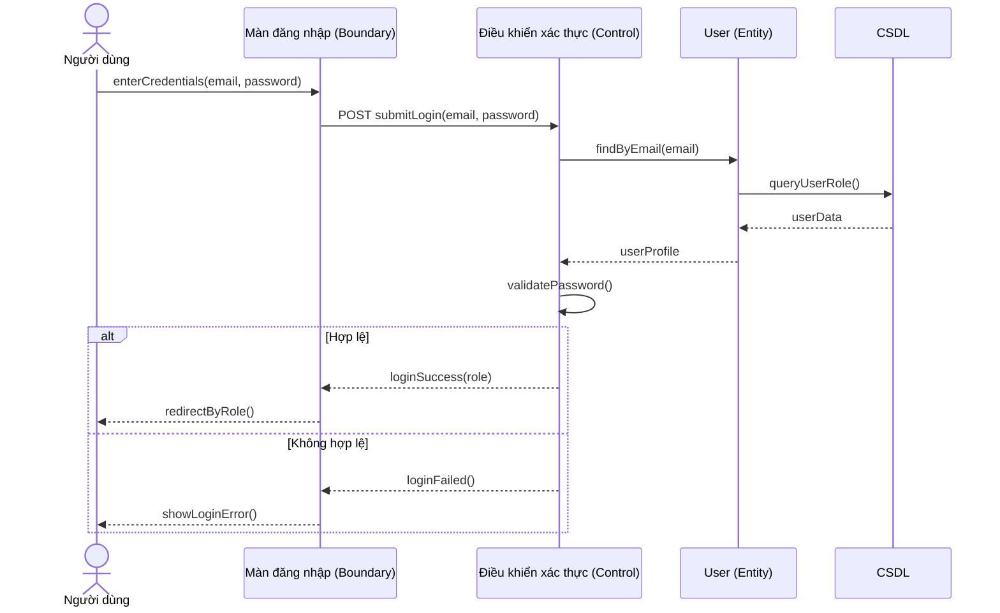

## U2 - Đăng xuất

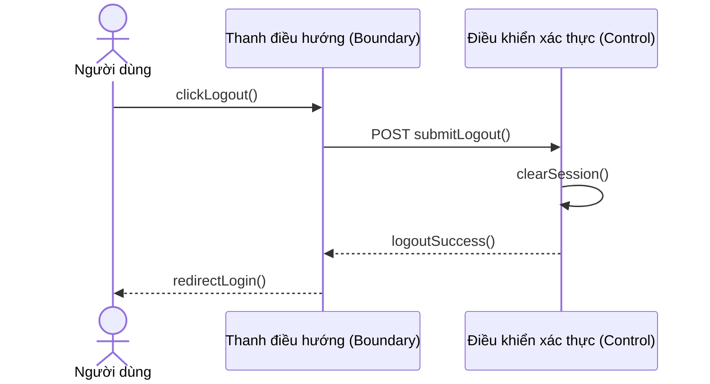

## U3 - Đăng ký tài khoản

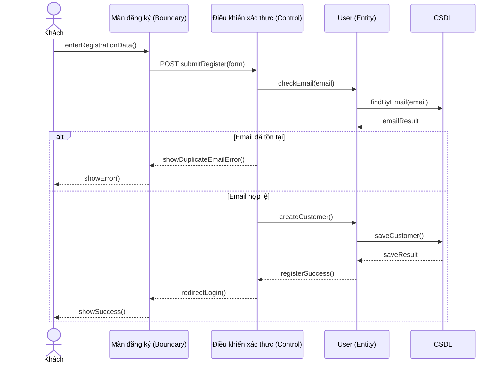

## U4 - Xem và tìm kiếm sản phẩm

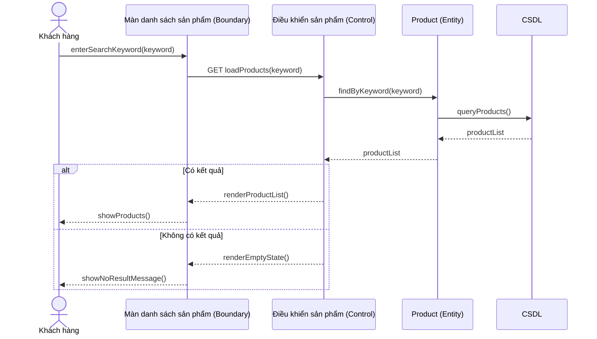

## U5 - Thêm vào giỏ và quản lý giỏ hàng

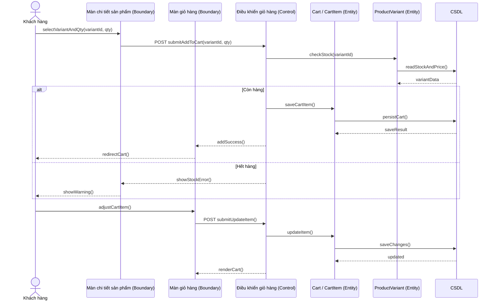

## U6 - Thanh toán và đặt hàng

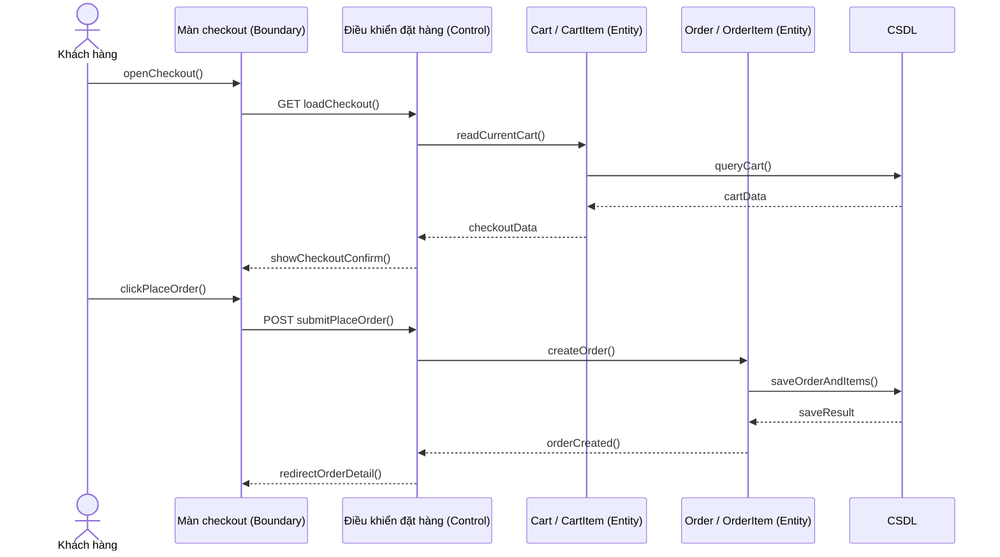

## U7 - Thanh toán COD hoặc VNPAY

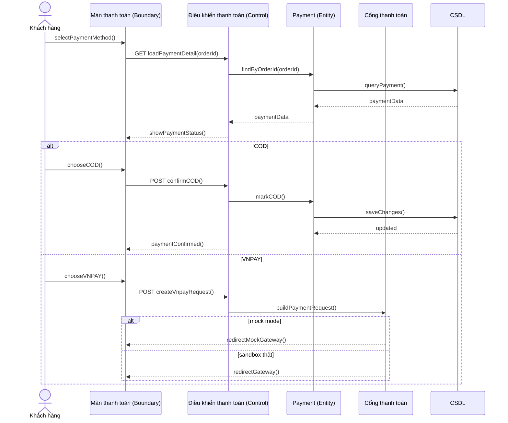

## U8 - Theo dõi vận chuyển

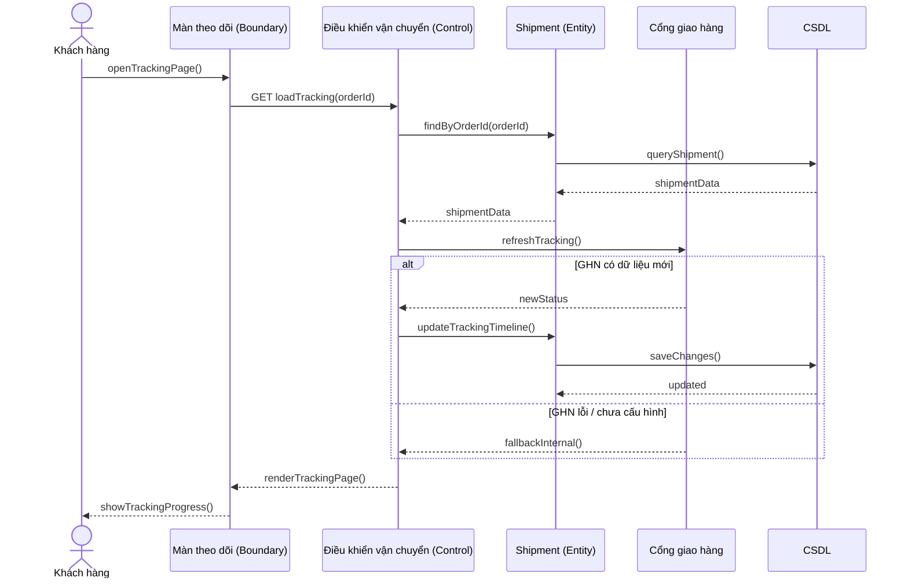

## U9 - Hủy đơn khi được phép

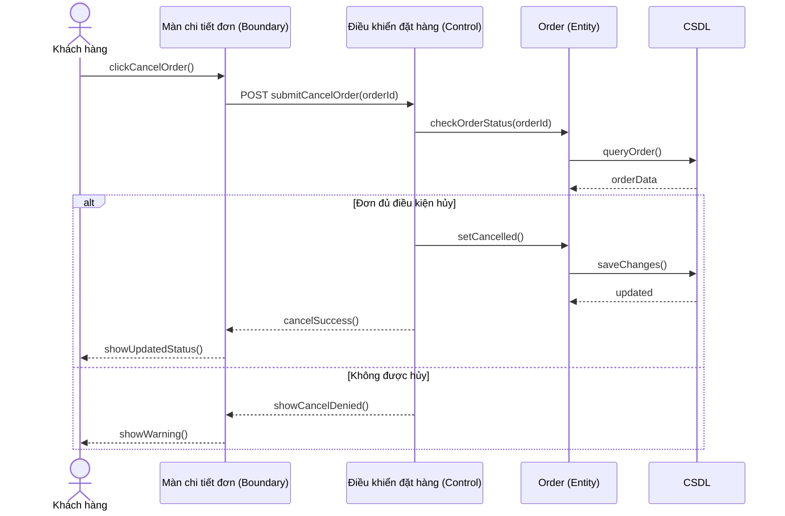

## U10 - Đánh giá sản phẩm đã mua

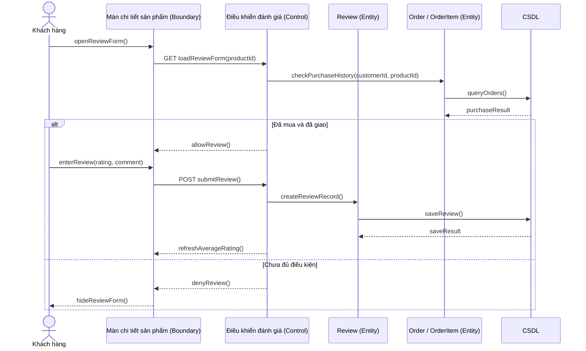

## U11 - Cập nhật thông tin cá nhân và địa chỉ

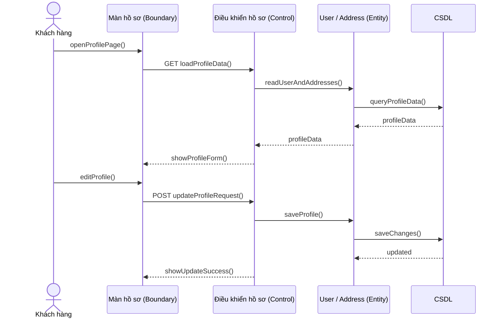

## U12 - Tiếp nhận và xử lý đơn hàng

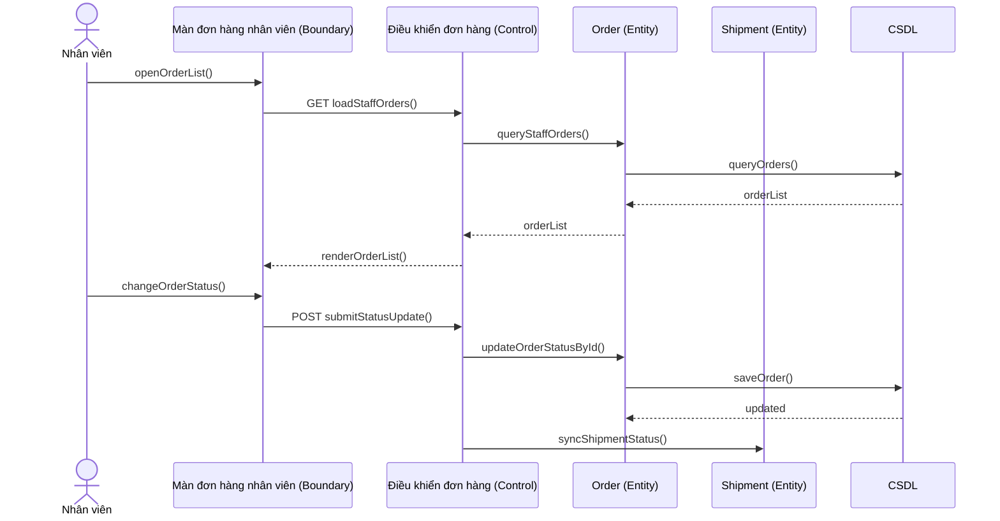

## U13 - Quản lý sản phẩm

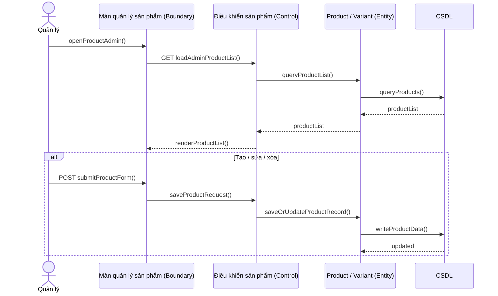

## U14 - Xem báo cáo kinh doanh

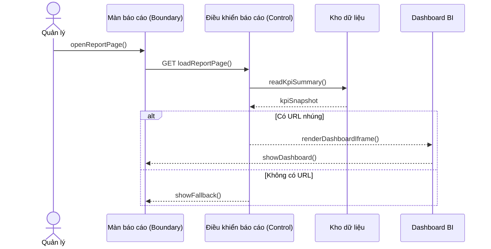

## U15 - Xử lý phản hồi của khách hàng

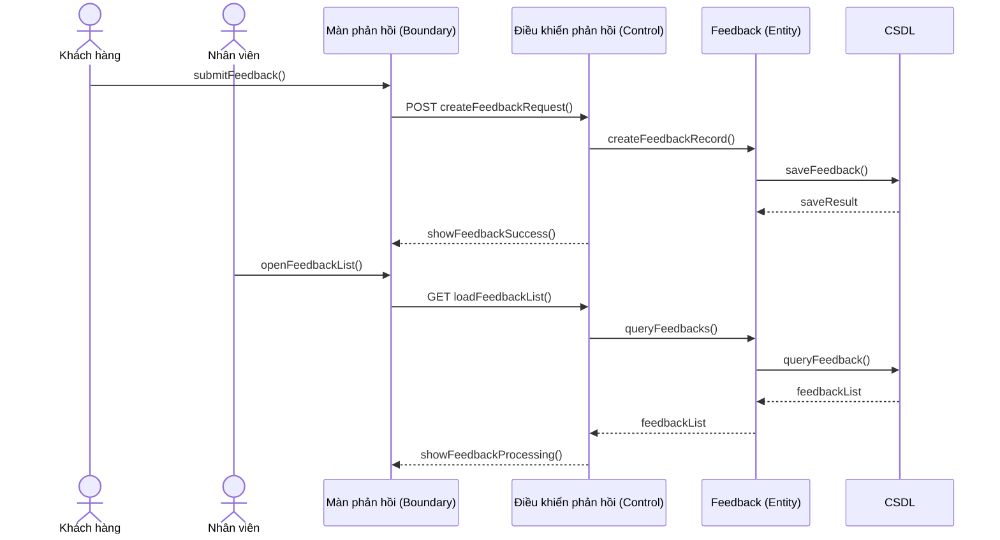

## U16 - Xác thực giao dịch thanh toán

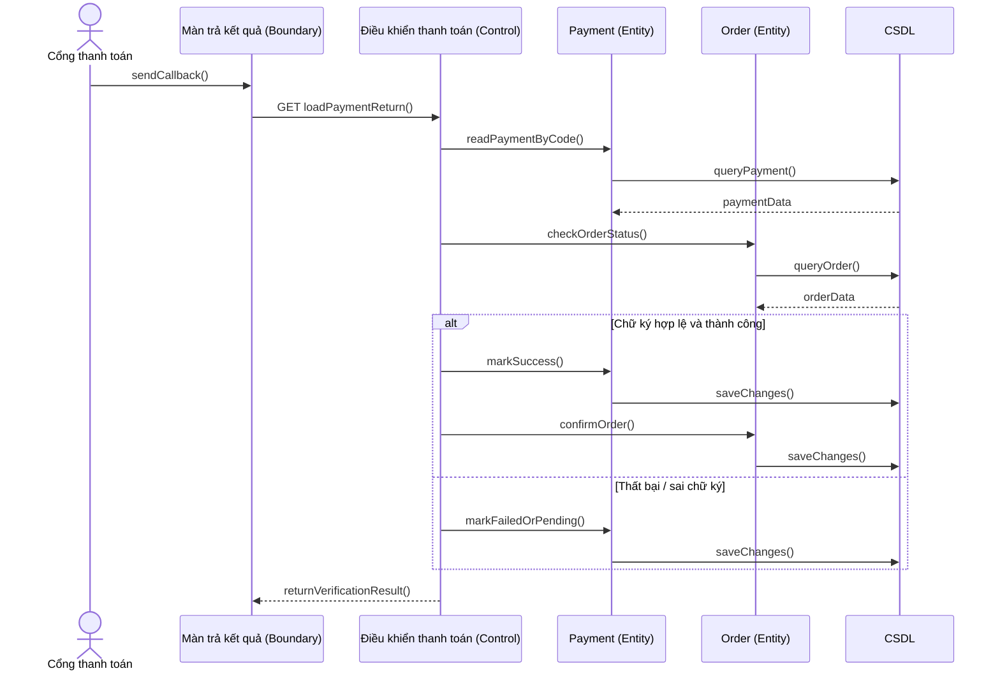

## U17 - Cập nhật lộ trình vận chuyển

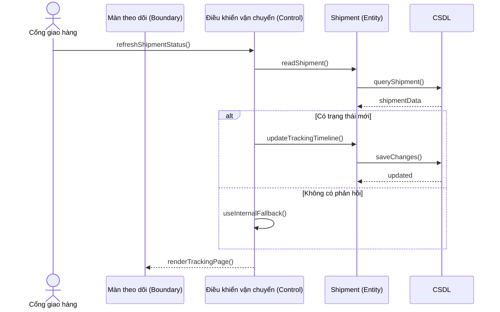

---

## Tự Kiểm Tra

Đối chiếu với bất kỳ use case nào trong tài liệu:

- Có Actor chưa?
- Có Boundary chưa?
- Có Control chưa?
- Có Entity chưa?
- Có method / hành động rõ ràng chưa?
- Luồng chính và luồng phụ đã được thể hiện bằng `alt` / `else` chưa?

Nếu có đủ, thì biểu đồ tuần tự đã đạt yêu cầu của Buổi 3.
